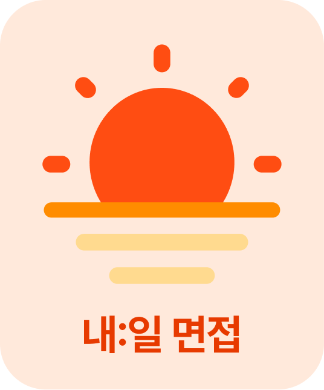
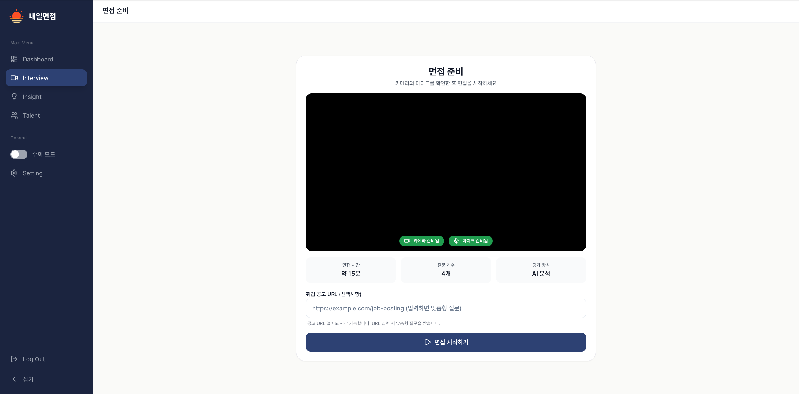
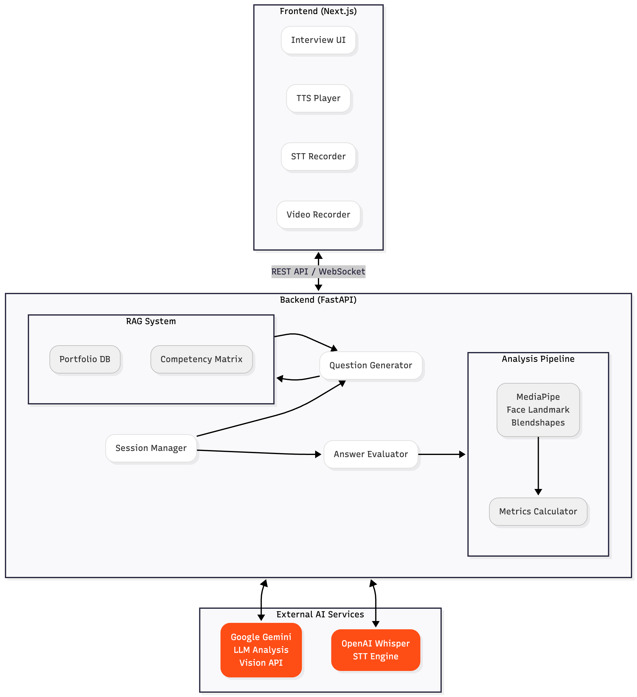

# 2025 RE:AL Thon - GDGoC 5개 대학 연합 해커톤

<div align="center">

<h1>내:일 면접</h1>
<p>AI 기반 실시간 면접 시뮬레이션 및 분석 플랫폼</p>
</div>

> 대회 기간: 2025.11.22(토) 13:00 ~ 2025.11.23(일) 14:00
>
> 팀명: 참새와 고양이 (11팀)
>
> Built with Python 3.12, FastAPI 0.115.5, Next.js 14, Google Gemini API, MediaPipe

## 프로젝트 개요

대학생들이 취업 준비 과정에서 겪는 면접 연습의 어려움을 해결하기 위해 개발된 AI 면접 시뮬레이션 플랫폼입니다.

실제 면접과 유사한 환경에서 AI가 실시간으로 질문을 생성하고, 답변 내용을 분석하여 맞춤형 꼬리 질문을 제공합니다. 면접 종료 후에는 의사소통 능력, 전문성, 문제해결력, 태도 등 다차원적인 분석 결과와 개선 제안을 시각화된 리포트로 제공합니다.

음성 면접뿐만 아니라 **수화 면접 모드**를 지원하여 청각장애 학생들도 동등하게 면접 연습을 할 수 있는 포용적인 서비스입니다.

## 서비스 화면



## 핵심 기능

### 1. 포트폴리오 기반 맞춤형 면접

포트폴리오(PDF)를 업로드하면 AI가 분석하여 지원자의 역량을 파악합니다.

- **CV 분석**: PDF에서 텍스트 추출 후 Gemini Vision API로 경력, 기술 스택, 프로젝트 경험 분석
- **GitHub 분석**: GitHub 프로필 연동 시 실제 코드 기여도, 사용 언어, 프로젝트 품질 분석
- **RAG 기반 역량 평가**: 직무별(Frontend/Backend/AI) 다른 개발자들의 포트폴리오 및 역량 요구사항과 비교하여 6가지 역량 점수화
- **맞춤형 질문 생성**: 포트폴리오 내용을 기반으로 개인화된 면접 질문 자동 생성

### 2. 채용 공고 연동

채용 공고 URL을 입력하면 해당 공고에 맞는 면접 질문을 생성합니다.

- **웹 스크래핑**: BeautifulSoup으로 채용 공고 내용 자동 추출
- **공고 분석**: 직무 요구사항, 우대사항, 기술 스택 파악
- **포트폴리오 + 공고 매칭**: 지원자의 역량과 공고 요구사항을 비교하여 예상 질문 생성

### 3. 실시간 AI 면접 시뮬레이션

#### 음성 면접 모드

- **TTS (Text-to-Speech)**: MeloTTS를 활용한 자연스러운 질문 음성 출력
- **STT (Speech-to-Text)**: OpenAI Whisper로 답변 실시간 텍스트 변환
- **동적 꼬리 질문**: 답변 내용을 Gemini가 분석하여 맞춤형 후속 질문 자동 생성

#### 수화 면접 모드 (향후 계획)

청각장애인을 위한 수화 면접 기능을 개발 중입니다.

- **현재 구현**: 수화 모드 UI, 비디오 녹화 기능
- **개발 예정**: MediaPipe Holistic 기반 수화 동작 인식 및 텍스트 변환

### 4. 비언어적 행동 분석

MediaPipe FaceLandmarker를 활용하여 면접 중 비언어적 행동을 실시간 분석합니다.

| 분석 항목 | 기술 | 설명 |
|-----------|------|------|
| 시선 추적 | Iris Landmark | LEFT/RIGHT/CENTER 시선 방향 감지 |
| 표정 분석 | Blendshapes | 미소, 긴장, 걱정 등 감정 상태 인식 |
| 머리 자세 | solvePnP | Yaw, Pitch, Roll 각도 측정 |
| 감정 인식 | Rule-based | happy, pleasant, neutral, focused, concerned 분류 |

### 5. 타임스탬프 기반 피드백

유튜브 스타일의 타임라인 피드백을 제공합니다.

- **프레임별 분석**: 매 타임스탬프마다 비언어적 행동 체크
- **실시간 알림**: 시선 이탈, 부자연스러운 표정 등 즉시 감지
- **타임스탬프 네비게이션**: 영상 재생 중 하단에 피드백 포인트 표시, 클릭하면 해당 시점으로 이동
- **Gemini 피드백**: 각 구간에 대한 AI 기반 상세 코멘트

### 6. 종합 분석 리포트

면접 종료 후 다차원적인 분석 결과를 제공합니다.

- **비언어적 메트릭**: 시선 집중도, 미소 비율, 고개 끄덕임 횟수, 감정 분포
- **언어적 메트릭**: WPM(분당 단어 수), 필러 워드 횟수
- **시각화**: Radar Chart, Pie Chart를 활용한 직관적인 분석 결과
- **AI 피드백**: Gemini 2.0 Flash를 활용한 개인화된 개선 제안

## 시스템 아키텍처



## 프로젝트 구조

```
RealThon-2025/
├── frontend/
│   ├── src/
│   │   ├── app/
│   │   │   ├── interview/           # 면접 페이지
│   │   │   │   ├── components/
│   │   │   │   │   ├── screens/     # Waiting, Interviewing, Complete, Analyzing
│   │   │   │   │   └── layout/      # Header, Sidebar
│   │   │   │   └── page.tsx
│   │   │   ├── profile/             # 프로필 페이지
│   │   │   ├── setup/               # 면접 설정 (수화 모드 토글)
│   │   │   └── onboarding/          # 온보딩
│   │   ├── components/              # 공통 컴포넌트
│   │   └── lib/                     # API clients
│   └── package.json
│
├── backend/
│   ├── main.py                      # FastAPI 앱
│   ├── routers/
│   │   ├── interviews.py            # 면접 세션 관리
│   │   ├── portfolios.py            # 포트폴리오 업로드/분석
│   │   ├── job_postings.py          # 채용공고 스크래핑
│   │   ├── video_analysis.py        # 비디오 분석 파이프라인
│   │   └── voice_sessions.py        # 음성 면접 세션
│   ├── pipeline/
│   │   ├── vision_mediapipe.py      # MediaPipe 비전 분석
│   │   ├── metrics.py               # 비언어적 메트릭 계산
│   │   └── feedback_generator.py    # Gemini 피드백 생성
│   ├── services/
│   │   ├── cv_analyzer.py           # CV 분석
│   │   ├── github_analyzer.py       # GitHub 분석
│   │   ├── capability_evaluator.py  # 역량 평가
│   │   └── job_posting_crawler.py   # 채용공고 크롤러
│   ├── rag/
│   │   ├── data/                    # 참조 데이터 (역량 매트릭스, 평가 루브릭)
│   │   └── utils/                   # RAG 유틸리티
│   ├── clients/
│   │   ├── gemini_client.py         # Gemini API 클라이언트
│   │   ├── whisper_client.py        # Whisper STT 클라이언트
│   │   └── melo_tts_client.py       # MeloTTS 클라이언트
│   └── models.py                    # SQLAlchemy 모델
│
├── images/
│   └── logo.png
│
└── README.md
```

## 기술 스택

### Frontend

| 기술 | 버전 | 용도 |
|------|------|------|
| Next.js | 14.2 | React 프레임워크 |
| TypeScript | 5 | 타입 안정성 |
| Tailwind CSS | 3.4 | 스타일링 |
| Framer Motion | 12.23 | 애니메이션 |
| Nivo | 0.99 | 차트 시각화 (Radar, Pie) |

### Backend

| 기술 | 버전 | 용도 |
|------|------|------|
| FastAPI | 0.115.5 | 웹 프레임워크 |
| SQLAlchemy | 2.0.36 | ORM |
| Google Generative AI | 0.8.5 | LLM (질문 생성, 분석, 피드백) |
| OpenAI Whisper | 20250625 | STT (음성 인식) |
| MediaPipe | 0.10.14 | 비전 분석 (얼굴, 수화) |
| BeautifulSoup4 | 4.12.3 | 웹 스크래핑 |
| PyPDF2 | 3.0.1 | PDF 파싱 |
| OpenCV | 4.12.0 | 비디오 처리 |

### AI 모델

| 모델 | 용도 |
|------|------|
| Gemini 2.0 Flash | 질문 생성, 답변 분석, 피드백 생성 |
| Gemini Vision | PDF/이미지에서 텍스트 추출 |
| Whisper (base) | 음성 -> 텍스트 변환 |
| MediaPipe FaceLandmarker | 얼굴 랜드마크, Blendshapes 추출 |

### Infrastructure

| 기술 | 용도 |
|------|------|
| Docker | 컨테이너화 |
| Railway | 배포 |
| SQLite | 데이터베이스 |

## 시작하기

### Prerequisites

- Node.js 18+
- Python 3.12+

### Frontend

```bash
cd frontend
npm install
npm run dev
```

### Backend

```bash
cd backend
python -m venv venv
source venv/bin/activate
pip install -r requirements.txt
uvicorn main:app --reload --port 8000
```

### 환경 변수

`backend/.env` 파일 생성:

```env
DATABASE_URL=sqlite:///./interview_app.db
SECRET_KEY=your-secret-key

# Gemini API (최대 3개까지 폴백 지원)
GEMINI_API_KEY1=your-gemini-api-key-1
GEMINI_API_KEY2=your-gemini-api-key-2
GEMINI_API_KEY3=your-gemini-api-key-3

# TTS Server
TTS_SERVER_URL=http://localhost:5000
```

## 팀 구성

| 이성민 (팀장) | 권태현 | 송재헌 |
|:------:|:------:|:------:|
|  |  |  |
| [@danlee-dev](https://github.com/danlee-dev) | [@Na1gae](https://github.com/Na1gae) | [@dreameerbb](https://github.com/dreameerbb) |
| 고려대학교 | 고려대학교 | 고려대학교 |

| 김지안 | 전희재 |
|:------:|:------:|
|  |  |
| [@jiankimr](https://github.com/jiankimr) | [@0914eagle](https://github.com/0914eagle) |
| 연세대학교 | 연세대학교 |

## 대회 정보

**RE:AL Thon** (REply via AI Machine Learning)은 AI 기반 솔루션을 통해 캠퍼스 라이프 개선에 대응하기 위해 개최된 GDGoC 5개 대학 연합 해커톤입니다.

### 주최

- GDGoC 고려대학교
- GDGoC 서강대학교
- GDGoC 성균관대학교
- GDGoC 연세대학교
- GDGoC 이화여자대학교

### 주관

- 고려대학교 SW중심사업단
- 서강대학교 SW중심사업단
- 성균관대학교 SW중심사업단
- 연세대학교 SW중심사업단

---

## Tech Stack

### Environment


### Frontend


### Backend


### AI/ML


### Database & Deployment


